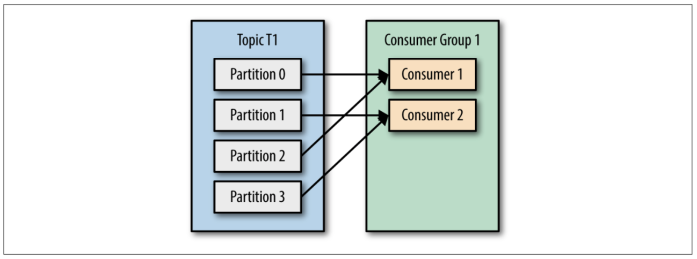
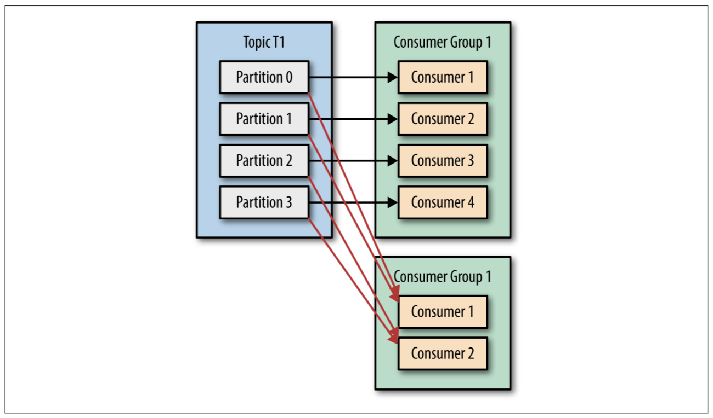
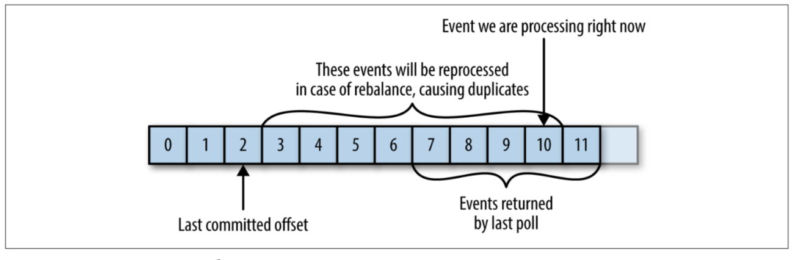
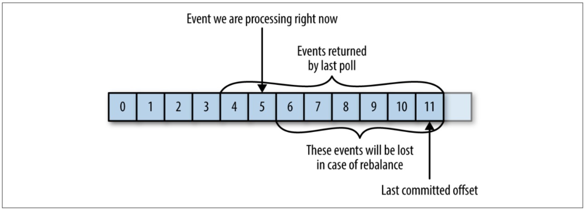

#### Consumers and Consumer Groups

- Kafka consumers are typically part of a consumer group. When multiple consumers are subscribed to a topic and belong to the same consumer group, each consumer in the group will receive messages from a different subset of the partitions in the topic.
- When an application wants to increase the speed of processing and process partitions in parallel then it can add more consumers to the consumer group. Kafka takes care of keeping track of offsets consumed per consumer in a consumer group, rebalancing consumers in the consumer group when a consumer is added or removed and lot more.
- When there are multiple consumers in a consumer group, each consumer in the group is assigned one or more partitions. Each consumer in the group will process records in parallel from each leader partition of the brokers. A consumer can read from more than one partitions.
- It’s very important to understand that no single partition will be assigned to two consumers in the same consumer group

- example of partition assigned in single group


- example of partition assigned in multiple group



#### Coordinator and leader discovery

- In order to manage the handshake between Kafka and application that forms consumer group and consumer, a coordinator on the Kafka side and a leader (one of the consumers in the consumer group) is elected. The first consumer that initiates the process is automatically elected as leader in the consumer group. As explained in the diagram below, for a consumer to join a consumer group following handshake processes take place:
 - **Find coordinator**
    - In order to create or join a group, a consumer has to first find the coordinator on the Kafka side that manages the consumer group. The consumer makes a “find coordinator” request to one of the bootstrap servers. If a coordinator already doesn’t exist it’s identified based on a hashing formula and returned as a response to “find coordinator” request.
 - **Join group**
    - Once the coordinator is identified, the consumer makes a “join group” request to the coordinator. The coordinator returns the consumer group leader and metadata details. If a leader already doesn’t exist then the first consumer of the group is elected as leader. Consuming application can also control the leader elected by the coordinator node.
 - **Sync group**
    - After leader details are received for the join group request, the consumer makes a “Sync group” request to the coordinator. This request triggers the rebalancing process across consumers in the consumer group, as the partitions assigned to the consumers, will change after the “sync group” request.
 - **Rebalance**
    - All consumers in the consumer group will receive updated partition assignments that they need to consume when a consumer is added/removed or “sync group” request is sent. Data consumption by all consumers in the consumer group will be halted until the rebalance process is complete.
 - **Heartbeat**
    - Each consumer in the consumer group periodically sends a heartbeat signal to its group coordinator. In the case of heartbeat timeout, the consumer is considered lost and rebalancing is initiated by the coordinator.
 - **Leave group**
    - A consumer can choose to leave the group anytime by sending a “leave group” request. The coordinator will acknowledge the request and initiate a rebalance. In case the leader node leaves the group, a new leader is elected from the group and a rebalance is initiated.

#### How Does the Process of Assigning Partitions to Brokers Work?
- When a consumer wants to join a group, it sends a JoinGroup request to the group coordinator. The first consumer to join the group becomes the group leader. The leader receives a list of all consumers in the group from the group coordinator (this will include all consumers that sent a heartbeat recently and which are therefore considered alive) and is responsible for assigning a subset of partitions to each consumer. It uses an implementation of Parti tionAssignor to decide which partitions should be handled by which consumer.
- Kafka has two built-in partition assignment policies, which we will discuss in more depth in the configuration section. After deciding on the partition assignment, the consumer leader sends the list of assignments to the GroupCoordinator, which sends this informa‐ tion to all the consumers. Each consumer only sees his own assign‐ ment—the leader is the only client process that has the full list of consumers in the group an

#### Thread Safety

- You can’t have multiple consumers that belong to the same group in one thread and you can’t have multiple threads safely use the same consumer.
- One consumer per thread is the rule. To run mul‐ tiple consumers in the same group in one application, you will need to run each in its own thread


#### Commits and Offsets
- Whenever we call poll(), it returns records written to Kafka that consumers in our group have not read yet. This means that we have a way of tracking which records were read by a consumer of the group. As discussed before, one of Kafka’s unique characteristics is that it does not track acknowledgments from consumers the way many JMS queues do. Instead, it allows consumers to use Kafka to track their posi‐ tion (offset) in each partition.
- How does a consumer commit an offset? It produces a message to Kafka, to a special __consumer_offsets topic, with the committed offset for each partition. As long as all your consumers are up, running, and churning away, this will have no impact. How‐ ever, if a consumer crashes or a new consumer joins the consumer group, this will trigger a rebalance. After a rebalance, each consumer may be assigned a new set of partitions than the one it processed before. In order to know where to pick up the work, the consumer will read the latest committed offset of each partition and con‐ tinue from there.
- If the committed offset is smaller than the offset of the last message the client pro‐ cessed, the messages between the last processed offset and the committed offset will be processed twice



- If the committed offset is larger than the offset of the last message the client actually processed, all messages between the last processed offset and the committed offset will be missed by the consumer group


- Ways to commit offset
  - Automatic Commit
    - enable.auto.commit=true
    - every five seconds the consumer will commit the largest offset your client received from poll()
    - The five-second interval is the default and is controlled by setting auto.commit.interval.ms
    - With autocommit enabled, a call to poll will always commit the last offset returned by the previous poll. It doesn’t know which events were actually processed, so it is critical to always process all the events returned by poll() before calling poll() again. (Just like poll(), close() also commits offsets automatically.)
  - Commit Current Offset
    - The consumer API has the option of committing the current offset at a point that makes sense to the application developer rather than based on a timer.
    - enable.auto.commit=false

    - CommitSync
    - Asynchronous Commit
      - One drawback of manual commit is that the application is blocked until the broker responds to the commit request. This will limit the throughput of the application. Throughput can be improved by committing less frequently, but then we are increas‐ ing the number of potential duplicates that a rebalance will create.

#### Rebalance Listeners
- a consumer will want to do some cleanup work before exiting and also before partition rebalancing
- Rebalance Listeners is a hook which is invoked during rebalancing
  - onPartitionsRevoked
  - onPartitionsAssigned

#### Rebalance triggers

- Number of partitions change for any of the subscribed list of topics
- Topic is created or deleted
- An existing member of the consumer group dies/ leaves group
- A new member is added to an existing consumer group via the join API
- Poll not getting called
  - After subscribing to a set of topics, the consumer will automatically join the group when poll(long) is invoked. The poll API is designed to ensure consumer liveness. As long as you continue to call poll, the consumer will stay in the group and continue to receive messages from the partitions it was assigned. Underneath the covers, the poll API sends periodic heartbeats to the server; when you stop calling poll (perhaps because an exception was thrown), then no heartbeats will be sent. If a period of the configured session timeout elapses before the server has received a heartbeat, then the consumer will be kicked out of the group and its partitions will be reassigned.

#### Consuming Records with Specific Offsets
- use poll() to start consuming messages from the last com‐ mitted offset in each partition and to proceed in processing all messages in sequence. However, sometimes you want to start reading at a different offset.
- If you want to start reading all messages from the beginning of the partition, or you want to skip all the way to the end of the partition and start consuming only new messages, there are APIs specifically for that: seekToBeginning(TopicPartition tp) and seekToEnd(TopicPartition tp).
- However, the Kafka API also lets you seek a specific offset. This ability can be used in a variety of ways; for example, to go back a few messages or skip ahead a few mes‐ sages (perhaps a time-sensitive application that is falling behind will want to skip ahead to more relevant messages). The most exciting use case for this ability is when offsets are stored in a system other than Kafka.

#### Standalone Consumer: Why and How to Use a Consumer without a Group

- Sometimes you know you have a single consumer that always needs to read data from all the partitions in a topic, or from a specific partition in a topic. In this case, there is no reason for groups or reba‐ lances—just assign the consumer-specific topic and/or partitions, consume messages, and commit offsets on occasion.
- When you know exactly which partitions the consumer should read, you don’t sub‐ scribe to a topic—instead, you assign yourself a few partitions. A consumer can either **subscribe** to topics (and be part of a consumer group), or **assign** itself partitions, but not both at the same time.


#### Partition assignment strategy
-  The partitions are assigned to consumers based on “partition.assignment.strategy” property
- Kafka built in partition assignment strategies:
  - Range strategy : default
  - Round-robin strategy

#### session timeout vs poll interval

- Before KIP-62, there is only session.timeout.ms (ie, Kafka 0.10.0 and earlier). max.poll.interval.ms is introduced via KIP-62 (part of Kafka 0.10.1).KIP-62, decouples heartbeats from calls to poll() via a background heartbeat thread, allowing for a longer processing time (ie, time between two consecutive poll()) than heartbeat interval.
- Assume processing a message takes 1 minute. If heartbeat and poll are coupled (ie, before KIP-62), you will need to set session.timeout.ms larger than 1 minute to prevent consumer to time out. However, if consumer dies, it also takes longer than 1 minute to detect the failed consumer.
- KIP-62 decouples polling and heartbeat allowing to sent heartbeat between two consecutive polls. Now you have two threads running, the heartbeat thread and the processing thread and thus, KIP-62 introduced a timeout for each. session.timeout.ms is for the heartbeat thread while max.poll.interval.ms is for the processing thread.
- Assume, you set session.timeout.ms=30000, thus, the consumer heartbeat thread must sent a heartbeat to the broker before this time expires. On the other hand, if processing of a single message takes 1 minutes, you can set max.poll.interval.ms larger than one minute to give the processing thread more time to process a message.
- If the processing thread dies, it takes max.poll.interval.ms to detect this. However, if the whole consumer dies (and a dying processing thread most likely crashes the whole consumer including the heartbeat thread), it takes only session.timeout.ms to detect it.
- The idea is, to allow for a quick detection of a failing consumer even if processing itself takes quite long.
- ref - https://stackoverflow.com/questions/39730126/difference-between-session-timeout-ms-and-max-poll-interval-ms-for-kafka-0-10

#### Consumer config

[config](https://kafka.apache.org/documentation/#consumerconfigs)

- Key configs
  - key.deserializer
  - value.deserializer
  - bootstrap.servers
  - fetch.min.bytes
  - fetch.max.bytes
  - group.id
  - group.instance.id
  - heartbeat.interval.ms
  - max.partition.fetch.bytes
  - session.timeout.ms
  - allow.auto.create.topics
  - auto.offset.reset
    -  earliest: automatically reset the offset to the earliest offset
    - latest: automatically reset the offset to the latest offset
    - none: throw exception to the consumer if no previous offset is found for the consumer's group
    - anything else: throw exception to the consumer.
  - client.dns.lookup
  - connections.max.idle.ms
  - default.api.timeout.ms
  - enable.auto.commit
  - exclude.internal.topics
  - isolation.level
  - max.poll.interval.ms
  - max.poll.records
  - partition.assignment.strategy
  - receive.buffer.bytes
  - send.buffer.bytes
  - request.timeout.ms
  - auto.commit.interval.ms
  - client.id
  - client.rack
  - fetch.max.wait.ms
  - interceptor.classes
  - metadata.max.age.ms
  - metric.reporters
  - reconnect.backoff.max.ms
  - reconnect.backoff.ms
  - retry.backoff.ms

#### Common syntax

- Subscribe to topic/s
```
consumer.subscribe(Collection<String> topics)
consumer.subscribe(Pattern)
```

- Assign topic-partitions

```
consumer.assign(Collection<TopicPartitions>)
```

#### Notes

- The high watermark is advanced once all the ISR replicates the latest offsets. A consumer can only read up to the value of the High Watermark (which can be less than the highest offset, in the case of acks=1)
- A topic has three replicas and you set min.insync.replicas to 2. If two out of three replicas are not available, what happens when a consume request is sent to broker?A topic has three replicas and you set min.insync.replicas to 2. If two out of three replicas are not available, what happens when a consume request is sent to broker?
  - With this configuration, a single in-sync replica is still readable, but not writeable if the producer using acks=all
