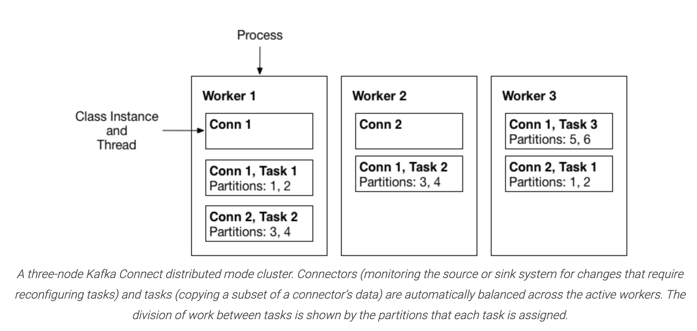
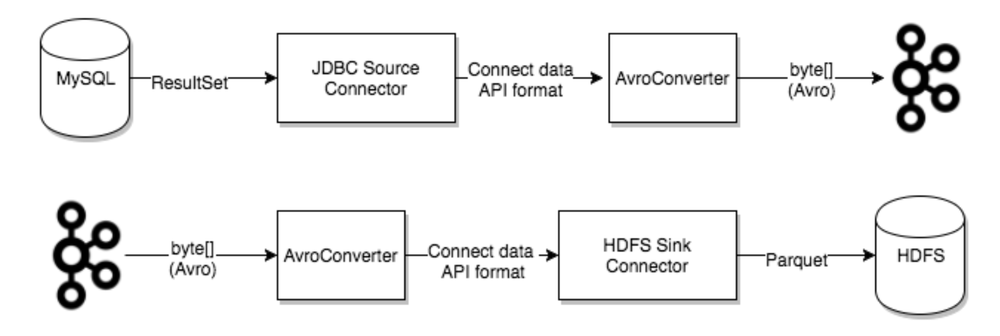

## Kafka Connect Concepts

#### Key concepts
- **Connectors** – the high level abstraction that coordinates data streaming by managing tasks
- **Tasks** – the implementation of how data is copied to or from Kafka
- **Workers** – the running processes that execute connectors and tasks
- **Converters** – the code used to translate data between Connect and the system sending or receiving data
- **Transforms** – simple logic to alter each message produced by or sent to a connector
- **Dead Letter Queue** – how Connect handles connector errors

#### Connectors
- A connector instance is a logical job that is responsible for managing the copying of data between Kafka and another system
- All of the classes that implement or are used by a connector are defined in a **connector plugin**
- Both connector instances and connector plugins may be referred to as “connectors”, but it should always be clear from the context which is being referred to (e.g., “install a connector” refers to the plugin, and “check the status of a connector” refers to a connector instance).

#### Tasks
-  Each connector instance coordinates a set of tasks that actually copy the data
- By allowing the connector to break a single job into many tasks, Kafka Connect provides built-in support for parallelism and scalable data copying with very little configuration
- These tasks have no state stored within them. Task state is stored in Kafka in special topics `config.storage.topic` and `status.storage.topic` and managed by the associated connector.
- Tasks may be started, stopped, or restarted at any time in order to provide a resilient, scalable data pipeline.

#### Task Rebalancing
- When a connector is first submitted to the cluster, the workers rebalance the full set of connectors in the cluster and their tasks so that each worker has approximately the same amount of work. This same rebalancing procedure is also used when connectors increase or decrease the number of tasks they require, or when a connector’s configuration is changed. When a worker fails, tasks are rebalanced across the active workers. When a task fails, no rebalance is triggered as a task failure is considered an exceptional case
- Failed tasks are not automatically restarted by the framework and should be restarted via the REST API.

#### Workers
- Connectors and tasks are logical units of work and must be scheduled to execute in a process. Kafka Connect calls these processes workers
- Types of workers:
  - standalone
    - Standalone mode is the simplest mode, where a single process is responsible for executing all connectors and tasks.
    - scalability is limited to the single process and there is no fault tolerance beyond any monitoring you add to the single process.
  - distributed
    -  many worker processes using the same `group.id` and they automatically coordinate to schedule execution of connectors and tasks across all available workers.
    - provides scalability and automatic fault tolerance for Kafka Connect
    - Under the covers, connect workers are using consumer groups to coordinate and rebalance.
- All workers with the same group.id will be in the same connect cluster. For example, if worker-a has group.id=connect-cluster-a and worker-b has the same group.id, worker-a and worker-b will form a cluster called connect-cluster-a.

#### Converters
- Converters are necessary to have a Kafka Connect deployment support a particular data format when writing to or reading from Kafka.
- Tasks use converters to change the format of data from bytes to a Connect internal data format and vice versa.
- By default, Confluent Platform provides the following converters:
  - **AvroConverter** io.confluent.connect.avro.AvroConverter: use with Schema Registry
  - **ProtobufConverter** io.confluent.connect.protobuf.ProtobufConverter: use with Schema Registry
  - **JsonSchemaConverter** io.confluent.connect.json.JsonSchemaConverter: use with Schema Registry
  - **JsonConverter** org.apache.kafka.connect.json.JsonConverter (without Schema Registry): use with structured data
  - **StringConverter** org.apache.kafka.connect.storage.StringConverter: simple string format
  - **ByteArrayConverter** org.apache.kafka.connect.converters.ByteArrayConverter: provides a “pass-through” option that does no conversion

- Converters are decoupled from connectors themselves to allow for reuse of converters between connectors naturally. For example, using the same Avro converter, the JDBC Source Connector can write Avro data to Kafka and the HDFS Sink Connector can read Avro data from Kafka. This means the same converter can be used even though, for example, the JDBC source returns a ResultSet that is eventually written to HDFS as a parquet file.

#### Transforms
- Connectors can be configured with transformations to make simple and lightweight modifications to individual messages.
- This can be convenient for minor data adjustments and event routing, and multiple transformations can be chained together in the connector configuration.
- However, more complex transformations and operations that apply to multiple messages are best implemented with **ksqlDB** and **Kafka Streams**.
- A transform is a simple function that accepts one record as an input and outputs a modified record
- When transforms are used with a source connector, Kafka Connect passes each source record produced by the connector through the first transformation, which makes its modifications and outputs a new source record. This updated source record is then passed to the next transform in the chain, which generates a new modified source record. This continues for the remaining transforms. The final updated source record is converted to the binary form and written to Kafka.
- Transforms can also be used with sink connectors. Kafka Connect reads message from Kafka and converts the binary representation to a sink record. If there is a transform, Kafka Connect and passes the record through the first transformation, which makes its modifications and outputs a new, updated sink record. The updated sink record is then passed through the next transform in the chain, which generates a new sink record. This continues for the remaining transforms, and the final updated sink record is then passed to the sink connector for processing.

#### Dead Letter Queue
- An invalid record may occur for a number of reasons. One example is when a record arrives at the sink connector serialized in JSON format, but the sink connector configuration is expecting Avro format. When an invalid record cannot be processed by a sink connector, the error is handled based on the connector configuration property `errors.tolerance`.
- Dead letter queues are only applicable for sink connectors.
- errors.tolerance
  - none
    - an error or invalid record causes the connector task to immediately fail and the connector goes into a failed state. To resolve this issue, you would need to review the Kafka Connect Worker log to find out what caused the failure, correct it, and restart the connector.
  - all
    - all errors or invalid records are ignored and processing continues. No errors are written to the Connect Worker log. To determine if records are failing you must use internal metrics or count the number of records at the source and compare that with the number of records processed.
- An error-handling feature is available that will route all invalid records to a special topic and report the error. This topic contains a dead letter queue of records that could not be processed by the sink connector.
