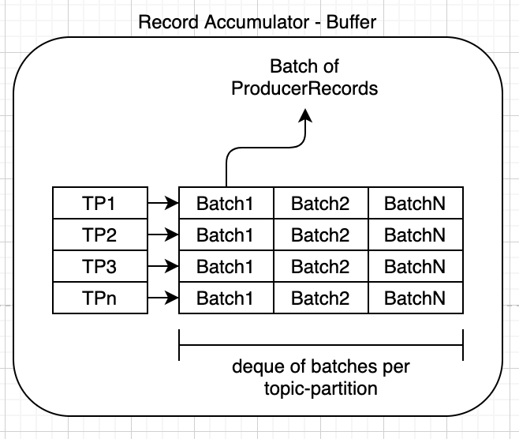

#### Broker and Metadata Discovery
- Any broker in a Kafka cluster can act as a bootstrap server. Generally, a list of bootstrap servers is passed instead of just one server. At least two bootstrap servers are recommended.
- In order to send a producer record to the appropriate broker, the producer first establishes a connection to one of the bootstrap servers. The bootstrap server returns a list of all the brokers available in the clusters and all the metadata details like topics, partitions, replication factors, and so on. Based on the list of brokers and metadata details, the producer identifies the leader broker that hosts the leader partition of the producer record and writes it to the broker.

#### Producer Record

- Record accumulator (memory buffer) - 1 per producer  

#### Work Flow
- Serialize -> Partition -> Compress -> accumulate records -> group batches by broker -> send
- Serialize
  - serialize producer record based on the provided serializer e.g. String serializer, ByteArray Serializer etc.
- Partition
  - decides which partition of the topic the producer record should be written to
  - Default : DefaultPartitioner
- Compress
  - producer record is compressed before it’s written to the record accumulator
  - default : compression is disabled
  - compression types : gzip, snappy, LZ4
- Record accumulator
  - In this step, the records are accumulated in a buffer per partition of a topic. Records are grouped into batches based on producer batch size property. Each partition in a topic gets a separate accumulator/buffer.
- Group by broker
  - Sender Thread
    - In this step, the batches of the partition in record accumulator are grouped by the broker to which they are to be sent. The records in the batch are sent to a broker based on batch.size and linger.ms properties. The records are sent by the producer based on two conditions. When the defined batch size is reached or defined linger time is reached
- Metadata refresh
  - Periodically on configured time
  - Also when it receives “Not a leader” error or similar related exceptions which needs a metadata refresh

#### Partitioners
- DefaultPartitioner
  - If a partition is specified in the record, use it
  - If no partition is specified but a key is present choose a partition based on a hash of the key (uses murmur2 algo)
  - If no partition or key is present choose the sticky partition that changes when the batch is full.
- RoundRobinPartitioner
  - This partitioning strategy can be used when user wants to distribute the writes to all partitions equally. This is the behavior regardless of record key hash.
- UniformStickyPartitioner
  - If a partition is specified in the record, use it
  - Otherwise choose the sticky partition that changes when the batch is full.
  - In contrast to the DefaultPartitioner, the record key is NOT used as part of the partitioning strategy in this partitioner. Records with the same key are not guaranteed to be sent to the same partition.
- Or define you own custom partitioner

#### Duplicate message detection

- Producers may send a duplicate message when a message was committed by Kafka but the acknowledgment was never received by the producer due to network failure and other issues. From Kafka 0.11 to avoid duplicate messages in case of scenario stated earlier Kafka tracks each message based on producer ID and sequence number. When a duplicate message is received for a committed message with same producer ID and sequence number then Kafka would treat the message as a duplicate message and will not committee message again but it will send the acknowledgment back to the producer so the producer can treat the message as sent.

#### Kafka producer delivery semantics

- At most once
  - In at most once delivery semantics a message should be delivered **maximum only once**. It's acceptable to **lose a message rather than delivering a message twice** in this semantic. Few use cases of at most once includes metrics collection, log collection and so on. Applications adopting at most semantics can easily achieve higher throughput and low latency.
  - No retries
  - Send and forget
  - **Acks = 0** : In this mode, chances for data loss is high as the producer does not confirm the message was received by the broker. The message may not have even reached the broker or broker failure soon after message delivery can result in data loss.
- At least once
  - In at least once delivery semantics it is acceptable to deliver a message **more than once but no message should be lost**. The producer ensures that all messages are delivered for sure even though it may result in message duplication. This is mostly preferred semantics out of all. Applications adopting at least once semantics may have moderate throughput and moderate latency.
  - send / retry -> ack
  - **Acks = 1** : When this property is set to 1 you can achieve at least once delivery semantics. Kafka producer sends the record to the broker and waits for a response from the broker. If no acknowledgment is received for the message sent, then the producer will retry sending the messages based on retry configuration. Retries property by default is 0 make sure this is set to desired number or Max.INT
  - In this mode, chances for data is moderate as the producer confirms that the message was received by the broker (leader partition). As the replication of follower partition happens after the acknowledgment this may still result in data loss. For example, after sending the acknowledgment and before replication if the broker goes down this may result in data loss as the producer will not resend the message.

- Exactly once
  - In exactly one delivery semantics a message must be delivered **only once and no message should be lost**. This is the most difficult delivery semantic of all. Applications adopting exactly once semantics may have lower throughput and higher latency compared other 2 semantics.
  - **Acks = All** : When acks property is set to all, you can achieve exactly once delivery semantics. Kafka producer sends the record to the broker and waits for a response from the broker. If no acknowledgment is received for the message sent, then the producer will retry sending the messages based on retry config n times. The broker sends acknowledgment only after replication based on min.insync.replica property.
  - For example, a topic may have a replication factor of 3 and min.insync.replica of 2. In this case, an acknowledgment will be sent after the second replication is complete. In order to achieve exactly once delivery semantics the broker has to be idempotent. Acks = all should be used in conjunction with min.insync.replicas.
  - In this mode, chances for data loss is low as the producer confirms that the message was received by the broker (leader and follower partition) only after replication. As the replication of follower partition happens before the acknowledgment data loss chances are minimal. For example, before replication and sending acknowledgment if the broker goes down, the producer will not receive the acknowledgment and will send the message again to the newly elected leader partition.
  - **Exception** : When there are not enough nodes to replicate as per **min.insync.replica** property then the broker would return an exception instead of acknowledgment.

- Delivery semantics

| |At most once|At lease once|Exactly once|
|--|---------|---|-----|  
Duplicates|No|Yes|No
Data loss|Yes |No|No
Processing|Zero or one time|One or more times|Exactly one time

- Ack impact

|Acks|Latency|Throughput|Durability|
|----|-------|----------|---------|
|0|Low|High|No guarantee|
|1|Medium|Medium|Leader only|
|All|High|Low|All replicas|

#### Producer configs

[config](https://kafka.apache.org/documentation/#producerconfigs)

- Key configs
  - key.serializer
  - value.serializer
  - acks = {0,1,all}
  - bootstrap.servers
  - buffer.memory
  - retries
  - batch.size
  - linger.ms
  - client.id
  - max.in.flight.requests.per.connection
  - client.dns.lookup
  - connections.max.idle.ms
  - delivery.timeout.ms
  - max.block.ms
  - max.request.size
  - partitioner.class
  - receive.buffer.bytes
  - send.buffer.bytes
  - request.timeout.ms
  - enable.idempotence
  - interceptor.classes
  - max.in.flight.requests.per.connection
  - metadata.max.age.ms
  - metadata.max.idle.ms
  - metric.reporters
  - reconnect.backoff.max.ms
  - reconnect.backoff.ms
  - retry.backoff.ms
  - transaction.timeout.ms
  - transactional.id
  - other security related configs
